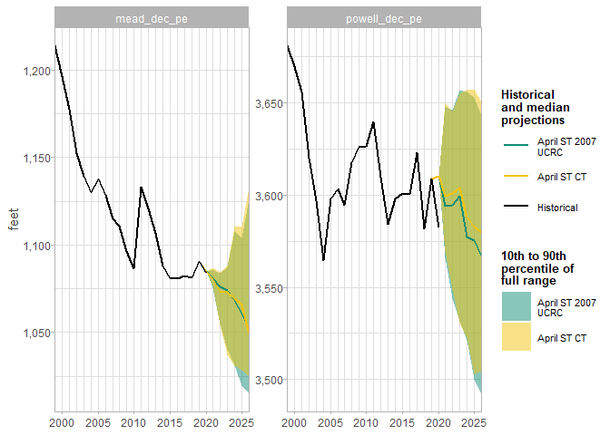
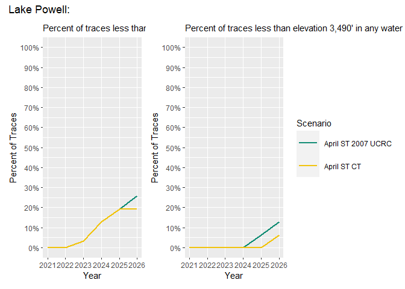
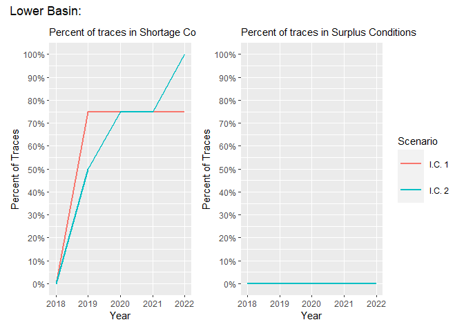
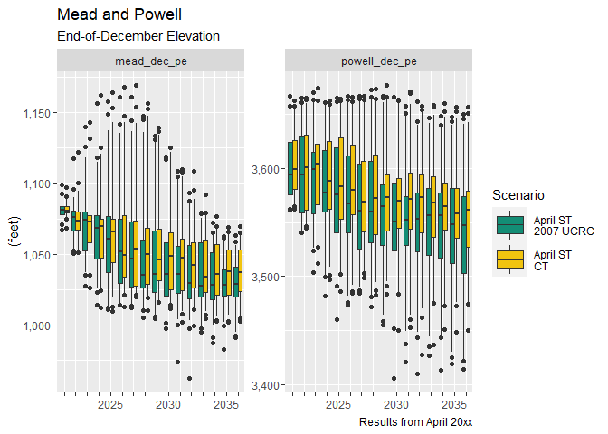
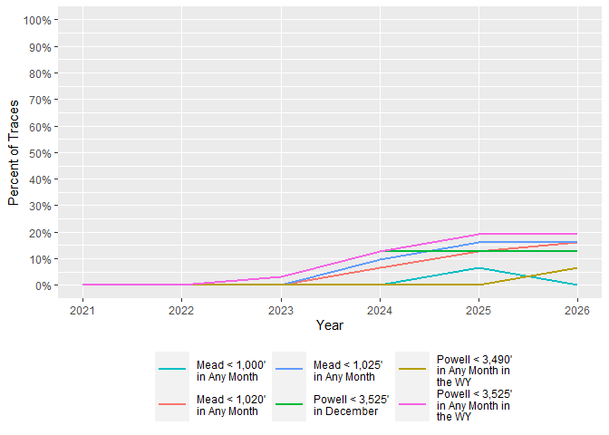
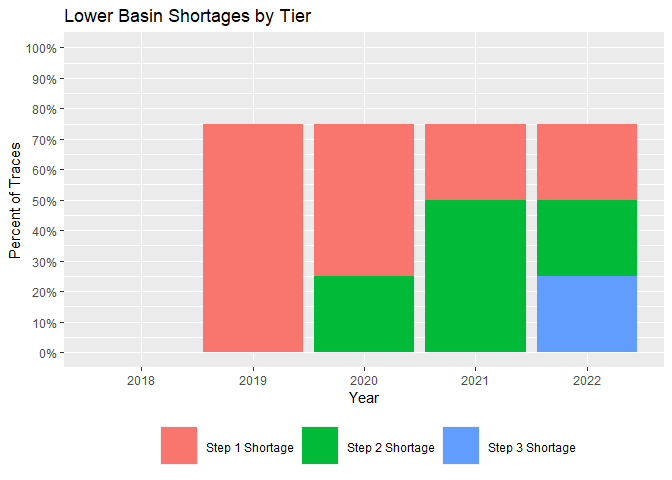

<!-- README.md is generated from README.Rmd. Please edit that file -->

# crssplot

**WIP** - working to convert
[BoulderCodeHub/Process-CRSS-Res](https://github.com/BoulderCodeHub/Process-CRSS-Res)
into a package.

Goals are to:

1.  Provide an easy, mostly automated way to produce the “standard” crss
    figures accross many scenarios.
2.  Provide a set of plots with a common API for creating new CRSS
    figures for any slot/variable. These functions can be wrapped in
    code from goal 1 in this package or used in other
    analyses/frameworks.

## Setup

    library(devtools)
    devtools::install_github('rabutler-usbr/crsspub')

## Standard Figures

1.  Setup a yaml file that determines which scenarios are used and which
    plots are created. [yaml
    Specification](https://github.com/BoulderCodeHub/Process-CRSS-Res/wiki/yaml-specification)
    includes the details about the yaml file configuration.
      - It does not matter where you save this file. It can be saved in
        this repository or in the CRSS folder.
2.  Then call:

<!-- end list -->

    ui <- parse_yaml_input("path/to/yml/file.yml")
    process_everything(ui)

See
[doc/README.md](https://github.com/BoudlerCodeHub/Process-CRSS-Res/doc/README.md)
for more details on how this process works in the overall CRSS
publication process.

## Generic Plotting Functions

This section demonstrates how to use the generic plotting functions to
recreate the standard CRSS results, though it does so using a
truncated/sample set of them.

``` r
library(crssplot)
library(ggplot2)
library(dplyr)
#> 
#> Attaching package: 'dplyr'
#> The following objects are masked from 'package:stats':
#> 
#>     filter, lag
#> The following objects are masked from 'package:base':
#> 
#>     intersect, setdiff, setequal, union
library(patchwork)
library(RWDataPlyr)
library(CRSSIO)

# ex_pe is sample data frame included with this package
# TODO: add in sample code that shows how to generate ex_pe from RWDataPlyr and
# add in the ScenarioGroup and add in the initial conditions
```

`ex_pe` is a data frame included with this package. It includes multiple
variables that are typically used in the generation of CRSS results. It
was created using RWDataPlyr, similar to the following example which
repeats the process, but uses the “system conditions”, i.e., binary
flags of system and operating conditions.

``` r
# use example data from RWDataPlyr
scen_path <- system.file("extdata/Scenario", package = "RWDataPlyr")
scens <- c(
  "I.C. 1" = "ISM1988_2014,2007Dems,IG,2002", 
  "I.C. 2" = "ISM1988_2014,2007Dems,IG,Most"
)

sys <- rw_scen_aggregate(scens, sys_cond_rwa(), scen_dir = scen_path)
#> Processing 2 total scenarios.
#> ------------------
#> ** Starting scenario 1 of 2: ISM1988_2014,2007Dems,IG,2002
#>    Processing 17 slots in SystemConditions.rdf
#> ** Starting scenario 2 of 2: ISM1988_2014,2007Dems,IG,Most
#>    Processing 17 slots in SystemConditions.rdf

# crssplot needs ScenarioGroup variable. Since we are not combining multiple
# scenarios together, it is the same as Scenario
sys$ScenarioGroup <- sys$Scenario
```

``` r
# Cloud figures
# get historical mead and powell data (examples stored with this pacakge)
h_mead <- read.csv("inst/extdata/HistMeadPE.csv")
h_powell <- read.csv("inst/extdata/HistPowellPE.csv")
hh <- h_mead
colnames(hh)[2] <- "mead_dec_pe"
hh$powell_dec_pe <- h_powell[,2]

pal <- c(
  "April ST 2007 UCRC" = "#138d75",
  "April ST CT" = "#f1c40f"
)

scens_plot_cloud(
  ex_pe, 
  c("powell_dec_pe", "mead_dec_pe"), 
  historical = hh, 
  legend_wrap = 15,
  plot_colors = pal, 
  y_lab = "feet", 
  years = 2020:2026,
  facet_scales = "free_y", 
  fill_label = "10th to 90th percentile of full range"
) +
  theme_cloud()
```



``` r
p1 <- scens_plot_probs(
  ex_pe, years = 2021:2026,
  vars = "powell_wy_min_lt_3525", 
  plot_colors = pal,
  subtitle = "Percent of traces less than elevation 3,525' in any water year"
) +
  expand_limits(y = c(0, 1))
p2 <- scens_plot_probs(
  ex_pe, years = 2021:2026,
  vars = "powell_wy_min_lt_3490", 
  plot_colors = pal,
  subtitle = "Percent of traces less than elevation 3,490' in any water year"
) +
  expand_limits(y = c(0, 1))

p1 + p2 +
  plot_layout(guides = "collect") +
  plot_annotation(title = "Lake Powell:")
```



``` r
# uses different data, so use default colors

p1 <- scens_plot_probs(
  sys, years = 2018:2026,
  vars = "lbShortage", 
  subtitle = "Percent of traces in Shortage Conditions"
) +
  expand_limits(y = c(0, 1))
p2 <- scens_plot_probs(
  sys, years = 2018:2026,
  vars = "lbSurplus", 
  subtitle = "Percent of traces in Surplus Conditions"
) +
  expand_limits(y = c(0, 1))

p1 + p2 +
  plot_layout(guides = "collect") +
  plot_annotation(title = "Lower Basin:")
```



``` r
p1 <- scens_plot_probs(
  ex_pe, years = 2021:2026,
  vars = "mead_dec_lt_1025", 
  plot_colors = pal,
  subtitle = "Percent of traces less than elevation 1,025' in December"
) +
  expand_limits(y = c(0, 1))
p2 <- scens_plot_probs(
  ex_pe, years = 2021:2026,
  vars = "mead_min_lt_1000", 
  plot_colors = pal,
  subtitle = "Percent of traces less than elevation 1,000' in any month"
) +
  expand_limits(y = c(0, 1))

p1 + p2 +
  plot_layout(guides = "collect") +
  plot_annotation(title = "Lake Mead:")
```


*Need LB Shortage added to data frame.* Not a limitation of the
plotting, rather a limitation of the example data I’m using.

``` r
vv <- c(
  "mead_min_lt_1020" = "Mead < 1,020' in Any Month",
  "powell_wy_min_lt_3490" = "Powell < 3,490' in Any Month in the WY",
  "powell_dec_lt_3525" = "Powell < 3,525' in December",
  "mead_min_lt_1000" = "Mead < 1,000' in Any Month",
  "mead_min_lt_1025" = "Mead < 1,025' in Any Month",
  "powell_wy_min_lt_3525" =  "Powell < 3,525' in Any Month in the WY"
)

vars_plot_probs(
  ex_pe, "April ST CT",
  years = 2021:2026, 
  vars = names(vv),
  var_labels = vv,
  legend_wrap = 15
) + 
  theme(legend.position = "bottom") +
  guides(color = guide_legend(nrow = 2)) +
  labs(color = NULL)
```



``` r
vv <- c(
  "lbShortageStep1" = "Step 1 Shortage",
  "lbShortageStep2" = "Step 2 Shortage",
  "lbShortageStep3" = "Step 3 Shortage"
)

vars_plot_probs(
  sys, "I.C. 1",
  years = 2018:2026, 
  vars = names(vv),
  var_labels = vv,
  legend_wrap = 15,
  plot_type = "stacked bar",
  title = "Lower Basin Shortages by Tier"
) + 
  theme(legend.position = "bottom") +
  guides(color = guide_legend(nrow = 1)) +
  labs(color = NULL)
```



``` r
vv <- c(
  "eq" = "Equalization Tier (Powell >= Equalization [EQ] Elevation)",
  "ueb" = "Upper Elevation Balancing Tier (Powell < EQ Elevation and >= 3,575')",
  "mer" = "Mid-Elevation Release Tier (Powell < 3,575' and >= 3,525')",
  "leb" = "Lower Elevation Balacing Tier (Powell < 3,525')"
)

# combine existing variables together
tmp_df <- bind_rows(
  filter(sys, Variable == "eq"),
  filter(sys, Variable %in% c("uebGt823", "ueb823", "uebLt823")) %>%
    group_by(Year, TraceNumber, ScenarioGroup) %>%
    summarise(Value = sum(Value)) %>%
    mutate(Variable = "ueb"),
  filter(sys, Variable %in% c("mer748", "mer823")) %>%
    group_by(Year, TraceNumber, ScenarioGroup) %>%
    summarise(Value = sum(Value)) %>%
    mutate(Variable = "mer"),
  filter(sys, Variable %in% c("lebGt823", "leb823", "lebLt823")) %>%
    group_by(Year, TraceNumber, ScenarioGroup) %>%
    summarise(Value = sum(Value)) %>%
    mutate(Variable = "leb")
)
#> `summarise()` regrouping output by 'Year', 'TraceNumber' (override with `.groups` argument)
#> `summarise()` regrouping output by 'Year', 'TraceNumber' (override with `.groups` argument)
#> `summarise()` regrouping output by 'Year', 'TraceNumber' (override with `.groups` argument)

vars_plot_heatmap(
  tmp_df, unique(tmp_df$ScenarioGroup),
  years = 2018:2026, 
  vars = names(vv),
  var_labels = vv,
  legend_wrap = 15,
  title = "Lake Powell Conditions from CRSS",
  subtitle = "Percent of Traces in each Elevation Range"
)
```


